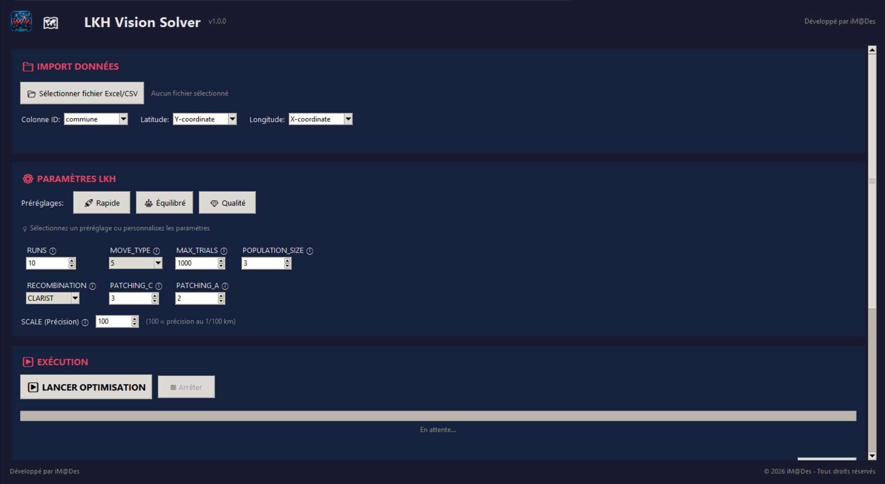
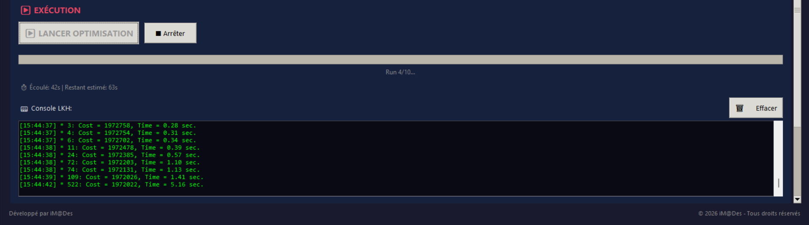
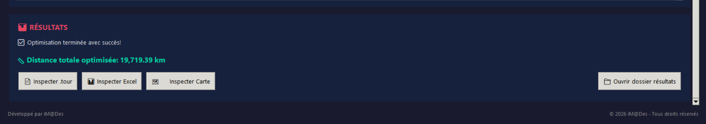

# 🗺️ LKH Vision Solver

[](https://www.python.org/downloads/)
[](#license)
[](#)

**Complete graphical solution for Traveling Salesman Problem (TSP) optimization**

© 2026 iM@Des - All rights reserved

---

## ✨ Features

### Core Features
- 📁 **Import** Excel/CSV files with geographic coordinates
- ⚙️ **Configure** LKH parameters with interactive tooltips
- 🚀 **Presets**: Fast (~10s), Balanced (~1min), Quality (~5min)
- 📊 **Real-time tracking** of optimization progress
- 📈 **Export** results to Excel with visiting order
- 🗺️ **Interactive map** visualization using Folium

### New in v1.1.0 🆕
- 🧮 **Conversion Mode Selector**: Choose between Haversine Matrix (pre-calculated distances) or LKH Coordinates (let LKH compute distances)
- ⚙️ **Advanced Parameters**: 9 new configurable LKH parameters in a collapsible section
- 📍 **EDGE_WEIGHT_TYPE Control**: Select how distances are calculated (EXPLICIT, EUC_2D, GEOM, GEO, etc.)

---

## 📸 Screenshots

### Main Interface


### Optimization in Progress


### Results


---

## 🚀 Quick Start

### 1. Install dependencies

```bash
pip install -r requirements.txt
```

### 2. Run the application

```bash
py -3 LKH_Vision_Solver.py
```

---

## 📋 Requirements

- Python 3.8 or higher
- Windows OS (LKH.exe included)
- Dependencies: `pandas`, `openpyxl`, `numpy`, `Pillow`, `folium`

---

## 📁 Project Structure & File Locations

```
LKH-Vision-Solver/
│
├── 📥 INPUT
│   └── Excel/
│       └── Imported/           ← Your imported Excel/CSV files
│
├── 🔄 INTERMEDIATE (LKH Files)
│   └── LKH_data/
│       ├── Data/               ← .tsp files (problem definition)
│       ├── config/             ← .par files (LKH parameters)
│       └── result/             ← .tour files (LKH solution)
│
├── 📤 OUTPUT
│   ├── Excel/results/          ← Excel with visiting order
│   └── Map_view/               ← Interactive HTML maps
│
├── 🔧 APPLICATION
│   ├── LKH_Vision_Solver.py    ← Main application (entry point)
│   ├── requirements.txt
│   ├── LKH_exe/               ← LKH solver executable
│   ├── python_scripts/        ← Core modules
│   └── icon/                  ← Application icon
│
└── 📖 DOCUMENTATION
    └── help/                  ← README.md, Walkthrough.md
```

---

## 📊 Input Data Format

Your Excel/CSV file should contain:

| ID | Latitude | Longitude |
|----|----------|-----------|
| 1 | 33.5731 | -7.5898 |
| 2 | 34.0209 | -6.8416 |
| ... | ... | ... |

> **Note**: Use decimal degrees (WGS84) for GPS coordinates.

---

## 🧮 Conversion Modes (v1.1.0)

LKH Vision Solver offers two conversion modes:

| Mode | Description | Best For |
|------|-------------|----------|
| **🧮 Haversine Matrix** | Pre-calculates all distances using Haversine formula. Creates EXPLICIT distance matrix. | GPS coordinates, maximum precision |
| **📍 LKH Coordinates** | Passes coordinates to LKH, lets it compute distances based on EDGE_WEIGHT_TYPE | Planar coordinates, custom distance types |

---

## ⚙️ LKH Parameters

### Standard Parameters

| Parameter | Default | Description |
|-----------|---------|-------------|
| RUNS | 10 | Number of optimization runs |
| MOVE_TYPE | 5 | Lin-Kernighan move type (2-5) |
| MAX_TRIALS | 1000 | Maximum trials per run |
| POPULATION_SIZE | 3 | Genetic algorithm population |
| RECOMBINATION | CLARIST | Recombination method |
| SCALE | 100 | Distance scaling factor |

### Advanced Parameters (v1.1.0) 🆕

| Parameter | Description | Default |
|-----------|-------------|---------|
| EDGE_WEIGHT_TYPE | Distance calculation type (EXPLICIT, EUC_2D, GEOM, etc.) | (auto) |
| CANDIDATE_SET_TYPE | Candidate construction method | ALPHA |
| MAX_CANDIDATES | Max candidates per node | 5 |
| INITIAL_TOUR_ALGORITHM | Initial tour algorithm | (auto) |
| KICKS | Number of kicks (perturbations) | 1 |
| KICK_TYPE | Type of kick | 4 |
| BACKTRACKING | Enable backtracking | (auto) |
| SEED | Random seed | 1 |
| TIME_LIMIT | Time limit in seconds (0=unlimited) | 0 |

### Presets

- 🚀 **Fast**: ~10 sec - Quick tests
- ⚖️ **Balanced**: ~1 min - Ideal compromise
- 💎 **Quality**: ~5 min - Best solution

---

## 📖 Documentation

- [README](help/README.md) - Full documentation
- [Walkthrough](help/Walkthrough.md) - Step-by-step user guide

---

## 📄 License

© 2026 iM@Des - All rights reserved

This software is proprietary. Unauthorized reproduction, distribution, or modification is strictly prohibited.

---

## 👤 Author

**iM@Des**

---

*Built with ❤️ for TSP optimization*
